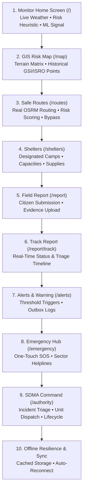

# SentinalX: SIH 2026 Live Demonstration Flow & Script
**Problem Statement SIH26001**: AI-Based Early Warning and Landslide Risk Monitoring System in NER  
**Official Brand**: `SentinalX`

---

## ⏱️ 3–5 Minute High-Impact Demonstration Script

---

### Step 1: Citizen Early Warning Monitor (`/`)
1. **Show Live Weather Integration**: Point out the live precipitation and antecedent 24h rainfall fetched directly from **Open-Meteo** for Tawang Sector.
2. **Explain Operational Risk Engine**: Explain the 6-factor geotechnical heuristic score (Rainfall 25%, Soil Moisture 20%, Hydrostatic Pore Pressure 20%, Slope 15%, Seismic 10%, Field Reports 10%).
3. **Show Auxiliary ML Signal**: Expand the risk intelligence card to show `SentinalX-NER-ML-v3` running with honest `LIMITED_DATA` status on `NER-LANDSLIDE-v3`.

---

### Step 2: Interactive GIS Terrain & Historical Layer (`/map`)
1. **Explore Geotechnical Matrix**: Show factor-of-safety (FoS) contour overlays and in-situ sensor telemetry nodes.
2. **Show Historical GSI/ISRO Layer**: Toggle the distinct **purple diamond markers** representing 25 verified historical landslide incidents across all 8 NER states from GSI Bhusanket and ISRO Landslide Atlas.

---

### Step 3: Risk-Aware Public Road Routing (`/routes`)
1. **Demonstrate Real OSRM Road Routing**: Show the live OpenStreetMap road distance (`2.8 km`), ETA (`5 min`), and step-by-step turn guidance for the Tawang Corridor.
2. **Explain Route Risk Scoring**: Show how SentinalX calculates hazard intersections, penalizes active landslide zones, and recommends the safest viable road bypass corridor.

---

### Step 4: Designated Relief Shelters (`/shelters`)
1. **Inspect Evacuation Destinations**: Show Tawang Community Center, Government Relief Camp, and District Relief Center with live capacity indicators and emergency inventory lists.
2. **Tap "Get Directions"**: Seamlessly transitions to the safe route navigation view.

---

### Step 5: Citizen Incident Reporting & Evidence Submission (`/report`)
1. **Submit a Field Report**: Select hazard type (`Landslide` or `Road Blockage`), choose severity level, add description, and submit.
2. **Instant Receipt**: Receive an authoritative tracking ID (e.g. `SX-LS-2048`).

---

### Step 6: Real-Time Incident Tracking (`/report/track?id=SX-LS-2048`)
1. **Show Report Lifecycle**: Display the visual timeline from `SUBMITTED` $\to$ `PENDING_VERIFICATION` $\to$ `RESPONSE_ASSIGNED` $\to$ `RESOLVED`.
2. **Transparency**: Grounded in fault-isolated persistence with local storage offline fallback.

---

### Step 7: Multi-Channel Alert & Warning Outbox (`/alerts`)
1. **Early Warning Triage**: Show active sector evacuation bulletins and warning levels (Yellow / Orange / Red).
2. **Notification Pipeline**: Inspect the prototype notification delivery outbox for SMS, WhatsApp, and siren broadcasts.

---

### Step 8: Emergency / SOS Response Hub (`/emergency`)
1. **One-Touch Emergency Access**: Show 1-tap direct helpline calls for NDRF, SDRF, and Police Control Room (112) alongside prototype response workflow.
2. **Offline Emergency Guidance**: Critical life-safety protocols accessible without network connection.

---

### Step 9: SDMA Authority Command Dashboard (`/authority`)
1. **Executive Operational Overview**: Show Active Responses, Active Alerts, Pending Field Reports, and Weather Telemetry.
2. **Triage Field Reports**: Tap **"Verify Report"** or **"Assign Response Unit"** (e.g., SDRF Quick Response Unit Alpha with 15-minute ETA).
3. **Response Status Lifecycle**: Transition response assignments from `ASSIGNED` $\to$ `EN_ROUTE` $\to$ `ON_SITE` $\to$ `COMPLETED`.

---

### Step 10: Low-Network & Offline Resilience (Phase 13 Compliance)
1. **Simulate Offline Disconnect**: Toggle offline mode in browser developer tools.
2. **Verify Resilient UI**: The application immediately reflects `OFFLINE` status without blank screens or unhandled errors.
3. **Cached Data Availability**: Last known risk scores, safe routes, shelters, and emergency guidance remain fully accessible.
4. **Auto-Reconnect Sync**: Reconnect network to observe automatic data freshness updates and tab visibility deduplication.

---

## 🔬 Scientific Honesty & ML Integrity Talking Points
- **Auxiliary ML Signal**: The machine learning model operates under `LIMITED_DATA` status ($37$ real samples across 8 NER states) and is an auxiliary research layer.
- **Four-Pillar Leakage Audit**: Temporal leakage (`False`), Spatial leakage (`False`, min distance $23.5\text{ km} > 15.0\text{ km}$), Same-incident leakage (`False`), and Duplicate leakage (`False`).
- **Authoritative Operational Engine**: The primary risk assessment is governed by the 6-factor geotechnical heuristic engine.
- **No Fabricated Data**: Open-Meteo, Copernicus DEM GLO-90, GSI Bhusanket, ISRO NRSC, and OpenStreetMap OSRM are transparently attributed.
