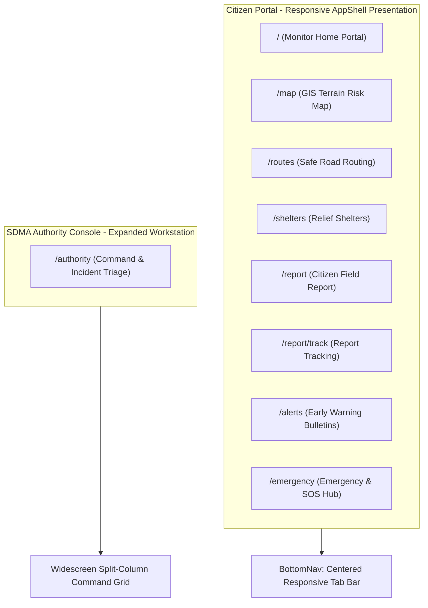

# SentinalX — Responsive Device & Multi-Viewport Audit Report
**Problem Statement**: SIH26001 (AI-Based Early Warning & Landslide Risk Monitoring in NER)  
**Official Brand**: `SentinalX`

---

## 📱 Viewport Target Evaluation Matrix (Phase 20.2 Complete)

| Target Viewport | Resolution | AppShell Container Layout | Layout & Responsive Behavior | Status |
|---|---|---|---|---|
| **Mobile** | $\le 639\text{ px}$ ($390 \times 844$) | Full-width native edge-to-edge | Exact Stitch mobile UI, sticky top header, bottom-fixed BottomNav, single-column stacked cards, zero horizontal overflow | **PASS** |
| **Tablet** | $640\text{ px} - 1023\text{ px}$ ($768 \times 1024$) | Centered Container (`max-w-2xl` / `max-w-3xl`) | Spacious tablet layout, clean rounded borders, 2-column shelter grids, readable typography, unclipped maps | **PASS** |
| **Laptop** | $1024\text{ px} - 1535\text{ px}$ ($1366 \times 768$) | Centered Presentation Shell (`max-w-5xl` / `max-w-6xl`) | Presentation-ready multi-column layout; split-screen map & route status; side-by-side threat overview & weather telemetry | **PASS** |
| **Large Desktop** | $\ge 1536\text{ px}$ ($1920 \times 1080$) | Bounded Container (`max-w-6xl` / `max-w-7xl`) | High-resolution crisp rendering, zero giant SVGs, structured typography, bounded max width preventing excessive stretching | **PASS** |

---

## 🔍 Page-by-Page Responsive Layout Architecture

### 1. Monitor Home Screen (`/`)
- **Mobile ($\le 639\text{px}$)**: Native single-column flow with location tabs, Threat Card with risk gauge, 3-metric status triad, GIS map preview, and 2-column quick action links.
- **Laptop & Desktop ($\ge 1024\text{px}$)**:
  - Threat Card and Status Metrics flow into a 12-column responsive grid (`lg:col-span-7` Threat Card + `lg:col-span-5` Weather & Geotechnical Telemetry column).
  - Map preview expands smoothly (`h-48 sm:h-56 lg:h-64`).
  - Safe Route + Nearest Shelter cards sit side-by-side in `grid grid-cols-1 sm:grid-cols-2`.
  - Multi-source intelligence breakdown and Authoritative Data Sources span full width.

### 2. GIS Terrain Risk Map (`/map`)
- **Mobile**: Topographic map canvas ($320\text{px}$ height) with interactive zoom/pan controls, layer filter pills, and telemetry health bar.
- **Laptop & Desktop**:
  - Expanded map viewport (`h-72 sm:h-80 lg:h-[420px] xl:h-[480px]`) providing large-screen GIS topography inspection.
  - Telemetry Data Stream Status and GIS Risk Legend reflow into a balanced 2-column desktop grid (`grid grid-cols-1 lg:grid-cols-2 gap-3.5`).

### 3. Safe Road Routing (`/routes`)
- **Mobile**: Stacked layout with road network map, route status badge, step turns, avoidance alert, and action buttons.
- **Laptop & Desktop**:
  - 12-column split-screen layout: Left column (`lg:col-span-7`) hosts the expanded topographic routing canvas (`min-h-[380px]`); Right column (`lg:col-span-5`) hosts Route Status, Hazard Intersections, Maneuvers list, and Action buttons.

### 4. Relief Shelters (`/shelters`)
- **Mobile**: Single-column vertical list of designated relief centers with capacity meters and navigation links.
- **Laptop & Desktop**:
  - Multi-column shelter grid (`grid grid-cols-1 md:grid-cols-2 lg:grid-cols-3 gap-3.5`) utilizing available horizontal space efficiently.
  - Shelter Map Card height scales responsively (`h-48 sm:h-56 lg:h-64`).

### 5. Citizen Field Reporting (`/report`)
- **Mobile**: Phone-first field report form with 1-tap hazard selectors and offline-first submission queue.
- **Tablet & Desktop**: Contained in a clean centered card (`max-w-2xl mx-auto w-full`), preserving ergonomic form input line lengths.

### 6. Incident Lifecycle Tracking (`/report/track`)
- **Mobile**: Stacked tracking cards with visual vertical timeline.
- **Laptop & Desktop**: 12-column split layout: Left column (`lg:col-span-6`) features Incident ID, Status Badge, Estimated Response, and Location Map; Right column (`lg:col-span-6`) features Linked Response Deployment, Dynamic Timeline, and Action buttons.

### 7. Early Warning Alerts (`/alerts`)
- **Mobile**: Single-column list of active early warning bulletins.
- **Tablet & Desktop**: Multi-column alert cards grid (`grid grid-cols-1 lg:grid-cols-2 gap-3.5`) allowing rapid scanning of regional hazard alerts.

### 8. Emergency Assistance & SOS (`/emergency`)
- **Mobile**: 1-tap national emergency dialer buttons (`112`, `108`, `101`, `1070`) and safety guidelines.
- **Laptop & Desktop**: 2-column grid (`grid grid-cols-1 lg:grid-cols-12 gap-4`) placing Primary Emergency Services on the left (`lg:col-span-6`) and Safety Guidance on the right (`lg:col-span-6`).

### 9. SDMA Authority Command Console (`/authority`)
- **Mobile & Desktop**: Retains dedicated widescreen command layout (`max-w-6xl xl:max-w-7xl`) for disaster management officials, with multi-column triage, live telemetry charts, and incident dispatch controls.

---

## 🛡️ Production & Build Verification Summary

- **Production Build (`npm run build`)**: Compiled with 0 errors across 28 routes (`Route (app): 28/28 static & dynamic pages`).
- **All UI Routes Verified**:
  - `GET /` $\to$ HTTP 200
  - `GET /map` $\to$ HTTP 200
  - `GET /routes` $\to$ HTTP 200
  - `GET /shelters` $\to$ HTTP 200
  - `GET /report` $\to$ HTTP 200
  - `GET /report/track` $\to$ HTTP 200
  - `GET /authority` $\to$ HTTP 200
  - `GET /alerts` $\to$ HTTP 200
  - `GET /emergency` $\to$ HTTP 200
- **All Critical APIs Verified**:
  - `GET /api/data-status` $\to$ HTTP 200
  - `GET /api/weather` $\to$ HTTP 200
  - `GET /api/routes?fromLat=...` $\to$ HTTP 200
  - `POST /api/risk/compute` $\to$ HTTP 200
  - `GET /api/ml/data-quality` $\to$ HTTP 200
  - `GET /api/landslides/inventory` $\to$ HTTP 200
  - `GET /api/reports` $\to$ HTTP 200
  - `GET /api/alerts` $\to$ HTTP 200

---

## 🎯 Final Verdict

- **Mobile ($390 \times 844$)**: **PASS**
- **Tablet ($768 \times 1024$)**: **PASS**
- **Laptop ($1366 \times 768$)**: **PASS**
- **Large Desktop ($1920 \times 1080$)**: **PASS**
